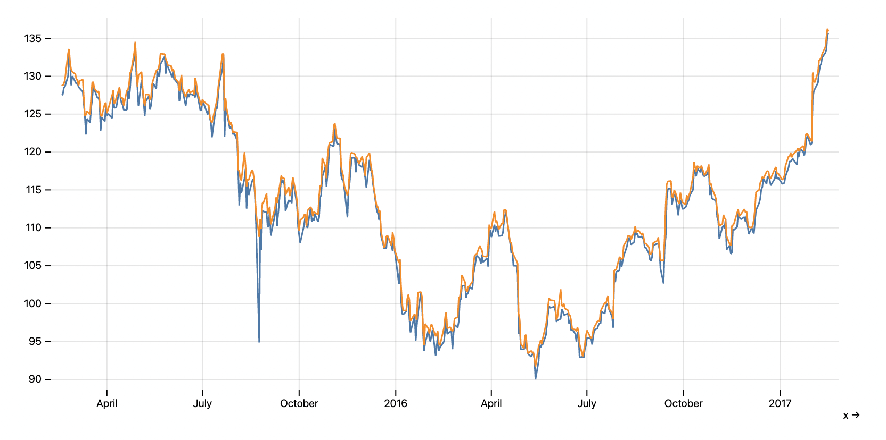

# Hal9

Hal9 provides a platform to develop Artificial Intelligence solutions with web technologies. This repo contains the open source components that power [hal9.ai](https://hal9.ai) which consist of:

- A `hal9.js` library which allows you to compose pipelines using less code.
- A library of steps to compose pipelines under the `/scripts` path.

## Getting Started

Here is a quick example that showcases a data pipeline to read a CSV and plot a line chart. Notice that each pipeline step contains a reference to the source to execute and the parameters associated to each step.

```html
<!DOCTYPE html>
<html>
  <head>
    <script src="https://cdn.jsdelivr.net/npm/hal9@latest/dist/hal9.js"></script> 
  </head>
  <body>
    <div id="output" style="margin: auto; width: 800px; height: 400px;"></div>
    <script>
      hal9.run([
        hal9.step('import/csv.txt.js', { file: 'https://raw.githubusercontent.com/plotly/datasets/master/finance-charts-apple.csv' }),
        hal9.step('charts/linechart.txt.js', { x: 'Date', y: [ 'AAPL.Open', 'AAPL.High' ] }, 'output')
      ]);
    </script>
  </body>
</html>
```



Please join our **Slack** group to help you get started, request access by sending us an email to `info@hal9.ai`.

Feel free to use our development environment [devel.hal9.ai](https://devel.hal9.ai); however, this environment produces daily builds and is not recommended for production use..

## Concepts

This repo contains everything related to the hal9 project, an application and service to make Artificial Intelligence more accessible.

The concepts behind this project are the following:
- **Pipeline:** A pipeline is a set of arbitrary operations executed sequentially.
- **Step:** A step is just a step to be executed in the pipeline.
- **Script:** A script is the code behind a pipeline's step. It's currently written in JavaScript but this could be extended in the future.
- **Header:** Each script has a YAML header that describes the script. It contains the input, output, parameters, environment, caching strategy, etc. that the script requires.
- **Parameters:** The parameters describes what values are passed to each script, think of them as function parameters to each script.

As you can see, there is nothing particular to Artificial Intelligence in those concepts. However, the pipelines step are specialized for AI applications that loosely follow these data processing stages:
- **Import:** Data is imported from a given location.
- **Transform:** Data is cleaned and transformed into a usable state.
- **Visualize:** Data is then rendered to find insights using a library of multiple scripts that support many charts.
- **Train:** Data is then used to create a predictive model.
- **Predict:** Data is then used for prediction or classification.
- **Explain:** The prediction can then be explained to gain further insights.
- **Export:** Elements of this workflow are then exported to 3rd parties.

Notice that most stages are optional, some users might want to just "Import and Visualize" data, or "Import and Predict using pre-trained models"; while others might want to make use of every step. In addition, the platform does not really know, nor care, that the scripts being run create an AI workflow.

This code repository is structured as follows:
- **API:** The [api](api/) path builds the public JavaScript API for developers to run pipelines.
- **Core:** The [core](core) path contains code to actually run the pipelines.
- **Scripts:** The [scripts](scripts/) path contains the pipelines steps used to compose data pipelines.
